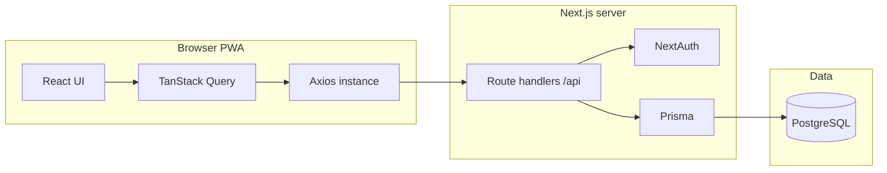

# দোকানদার.অ্যাপ — System design & architecture guide

This document explains **why** the stack and folder structure look the way they do, how data flows through the system, and how to extend the product safely. It is the companion to **[README.md](./README.md)** (setup & ops).

---

## 1. Product context

দোকানদার.অ্যাপ targets **small shopkeepers** who need reliable **বাকি**, **স্টক**, and **বিক্রয়** tracking on phones and low-end desktops. The product bias is: **fast onboarding**, **Bengali-first UX**, **offline-tolerant shell (PWA)**, and **minimal monthly cost** for an MVP SaaS.

---

## 2. High-level architecture

### 2.1 Single repository, full-stack Next.js (not a distributed monorepo)

This codebase is a **single deployable Next.js application**: UI (App Router under `src/app`) and **HTTP API** (`src/app/api/**/route.ts`) ship together.

That is **not** a Turborepo / pnpm-workspaces “monorepo” in the strict sense (multiple packages in one git clone). It **is** a **monolith-style repo** that still delivers the main MVP benefits people associate with early SaaS:

| Goal                      | How this repo achieves it                               |
| ------------------------- | ------------------------------------------------------- |
| Low hosting & ops surface | One Vercel (or similar) project, one runtime            |
| Fast iteration            | Shared types, one PR, one CI pipeline                   |
| Simple auth story         | NextAuth and API routes share cookies / env / DB        |
| Cost control              | No separate API fleet or container orchestration for v1 |

If the product outgrows this (e.g. mobile apps, background workers, public API for partners), you can **extract** bounded contexts (billing, notifications) into separate services **without** rewriting the domain model—Prisma and Zod schemas become natural migration boundaries.

### 2.2 Request path (simplified)

---

## 3. State management: TanStack Query instead of Redux

**Server state** (customers, stock, sales summaries) is fetched and mutated through **TanStack Query** (`src/hooks/dokandar.ts`).

| Concern                     | Redux Toolkit             | TanStack Query (chosen)                   |
| --------------------------- | ------------------------- | ----------------------------------------- |
| Caching & deduplication     | Manual or extra libraries | Built-in                                  |
| Stale data & refetch        | Custom                    | `staleTime`, window refocus, invalidation |
| Mutations + cache coherence | Boilerplate               | `invalidateQueries`, optimistic updates   |
| Boilerplate                 | Higher for async          | Lower for CRUD-style APIs                 |

**Client-only UI state** (dialog open, form drafts, POS line items before submit) stays in **React `useState` / `useMemo`** or **react-hook-form**—no global store needed yet.

**Rule of thumb:** If it came from the server or must stay consistent with the server, it belongs in **Query cache**. If it never leaves the component until submit, keep it **local**.

---

## 4. API layer: Axios instance and modular “services”

### 4.1 Axios instance (`src/lib/axios-instance.ts`)

The browser uses a **single `axios.create` instance**:

- **`baseURL`**: `NEXT_PUBLIC_API_URL` or default `"/api"` (same-origin cookies).
- **`withCredentials: true`**: session cookies flow to Route Handlers.
- **Interceptors**: reserved for centralized logging or 401 handling as the app grows.

This avoids scattering `fetch("/api/...")` with duplicated headers and error parsing.

### 4.2 “Service” pattern in practice

Strict **class-per-entity services** are optional overhead at MVP size. Instead, the codebase uses:

- **`src/hooks/dokandar.ts`** — typed API calls + TanStack Query keys and optimistic updates.
- **`src/lib/*.ts`** — domain helpers (`sms.ts`, `otp.ts`, `pdf/*`, `baki/*`, validations).

That split follows **SRP** (Single Responsibility): hooks own **cache orchestration**; libs own **pure logic** and **gateway integration**. When a module grows, promote it to `src/services/<domain>.ts` without changing UI contracts.

---

## 5. Database design & relations

Authoritative schema: **`prisma/schema.prisma`**. A **Mermaid ERD** for onboarding is also in **`docs/dokandar_db_schema.html`** (open locally in a browser).

### 5.0 Why PostgreSQL (not SQLite or MongoDB here)

The domain is **relational**: shops, customers, products, sales lines, append-only **বাকি** ledger rows, and stock movement logs with foreign keys and transactional checkout. **PostgreSQL** gives strong **ACID** guarantees, mature **row-level locking** for concurrent sales/stock updates, and **native `DECIMAL`** for money—important for a SaaS that may serve many shops over time.

- **SQLite** was only convenient for zero-setup local prototypes; it is a poor default for **multi-tenant serverless** (e.g. many concurrent writers on Vercel) and for **managed backups / replicas** you typically want on production.
- **MongoDB** fits flexible documents, but this app already models **fixed relations** and **ledger-style** rows; you would re-implement many integrity rules in application code. Prisma’s sweet spot here is **SQL + migrations**, so **PostgreSQL** is the default data store in `schema.prisma` and in deployment docs.

### 5.1 Tenant root: `Shop`

Everything commercial is scoped by **`shopId`** (future-proofing for multi-branch or B2B2B).

- **`User`** — belongs to a `Shop` (`shopId` FK). OTP login; `passwordHash` exists for future flows.
- **`Customer`** — belongs to a `Shop`.
- **`Product`** — belongs to a `Shop`; `stockOnHand` is the live quantity.
- **`Sale`** — belongs to a `Shop`; optional `customerId` for walk-in vs credit customer.
- **`SaleLine`** — lines on a `Sale`; each references a `Product`.
- **`CreditEntry`** — ledger rows for **বাকি** (`customerId`, optional `saleId` for sale-tied credit).
- **`StockLog`** — append-only movements (`quantityDelta`, `reason`) tied to `productId` and optionally `saleId`.

### 5.2 Core relationship narrative (Shop → Customer → CreditEntry)

1. A **`Shop`** owns **`Customer`** records (name, phone, notes).
2. **`CreditEntry`** rows append **financial facts** (amount, type, timestamp) for that customer.
3. **`Sale`** may create **`CreditEntry`** when checkout includes **বাকি** (`creditAmount` > 0 and `customerId` set)—see checkout transaction in `src/app/api/sales/checkout/route.ts`.

Derived balances (e.g. “total due”) can be computed from **`CreditEntry`** (and related sales) or denormalized later if read patterns demand it—the schema favors **append-only ledger** clarity.

### 5.3 Enums

- **`CreditEntryType`**: `SALE_CREDIT`, `PAYMENT`, `ADJUSTMENT`
- **`StockLogReason`**: `SALE`, `PURCHASE`, `ADJUSTMENT`, `RETURN`, `OPENING`

These keep reports and filters explicit without magic strings.

---

## 6. UX decisions: PWA vs native app

| Native app                          | PWA (this project)                   |
| ----------------------------------- | ------------------------------------ |
| Store review cycles                 | Instant deploy from CI               |
| Separate Android/iOS teams          | One React codebase                   |
| Larger install friction             | “Add to Home Screen” from browser    |
| Push notification complexity on iOS | Still evolving; SMS fills gaps today |

For **ক্ষুদ্র দোকানদার**, a **website that installs like an app** reduces friction and avoids app-store fees for an MVP. **`next-pwa`** caches shell assets so repeat visits feel snappy even on flaky networks; **financial writes** still prefer live API responses (NetworkFirst for `/api` in `next.config.js`).

---

## 7. Security & data integrity

### 7.1 Authentication (NextAuth)

- Session-based auth via **NextAuth** (`src/lib/auth-options.ts`, `src/app/api/auth/[...nextauth]/route.ts`).
- Route Handlers use **`requireShopApi`** (`src/lib/api/require-shop.ts`) to bind requests to `session.user.shopId`.

### 7.2 Validation (Zod)

- **Inbound JSON** is validated with **Zod** in API routes (`src/lib/validations/*`, `safeParse`, unified error messages via `zodFirstError`).
- **Forms** use **react-hook-form** + **`zodResolver`** where applicable; POS validates with `checkoutSchema.safeParse` before mutation.

### 7.3 Money & rounding

- **`decimal.js`** on the server for totals and comparisons; strings over the wire reduce float surprises.

### 7.4 SMS (SSL Wireless)

- **`src/lib/sms.ts`** implements SSL Wireless **ISMS+ JSON** (and optional legacy mode). Missing env vars fail closed with Bengali error strings; **`SMS_DISABLE_SEND`** supports dev without hitting the gateway.

---

## 8. SOLID & maintainability (practical mapping)

| Principle                 | Where it shows up                                                    |
| ------------------------- | -------------------------------------------------------------------- |
| **S**ingle responsibility | Thin `route.ts` files; heavy logic in Prisma transactions or `lib/`  |
| **O**pen/closed           | New report = new route + types, not edits to unrelated modules       |
| **L**iskov                | N/A (few inheritance hierarchies); favor composition in React        |
| **I**nterface segregation | Small exported types in `src/lib/reports/types.ts`, validation types |
| **D**ependency inversion  | UI depends on hooks + types, not on Prisma directly                  |

---

## 9. Extension checklist (for contributors)

1. **Schema** — edit `prisma/schema.prisma`, then `npx prisma migrate dev` (or `npm run db:migrate`) so changes are versioned; use `db:push` only for quick throwaway DBs.
2. **Validation** — add Zod schema under `src/lib/validations/`.
3. **API** — add `src/app/api/.../route.ts`, reuse `requireShopApi`.
4. **Client** — add TanStack Query hook in `dokandar.ts` (or split by domain if file grows).
5. **UI** — add module under `src/components/modules/...` and a page under `src/app/dashboard/...`.

---

## 10. Glossary

| Term          | Meaning in-app                                                          |
| ------------- | ----------------------------------------------------------------------- |
| বাকি          | Credit sold on account; tracked via `CreditEntry` + customer balance UX |
| স্টক          | `Product.stockOnHand` + `StockLog` history                              |
| দৈনিক বিক্রয় | Sales aggregated per calendar day (report routes)                       |

---

_Last updated to match the repository layout and Prisma schema as of this revision._
